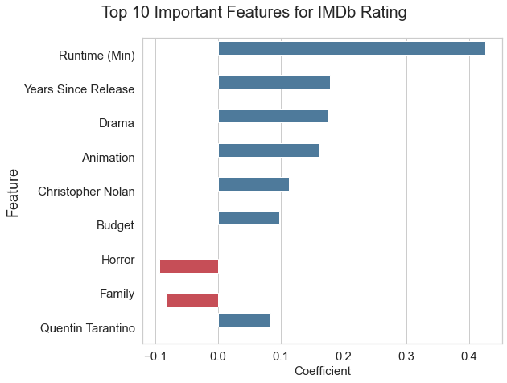

# Predicting IMDb Ratings with Linear Regression

## Contents
- [Notebook](imdb_rating_proj.ipynb) to run through my modeling process 
- [Folder](helper_functions) of .py files to properly run the notebook 
- Exact [data](data) I used for to create the model 
- [Visualizations](images) used in my final presentation 
- Slides for my final [presentation](imdb_rating_presentation.pdf) of the model 

Extras: Read the [blog post](https://towardsdatascience.com/predicting-imdb-movie-ratings-using-supervised-machine-learning-f3b126ab2ddb)

## Description
This repository contains a working model to predict IMDb ratings for a movie using features available prior to the movie's release. The model uses linear regression and features obtained through scraping movie information from IMDb using BeautifulSoup. 

## Features and Target Variables
- Target Variable: IMDb Rating
- Features: Runtime, MPAA Rating, Genre, Director, Writer, Stars, Production Company, Release Month, Years Since Release

## Data Used
Scraped over 8,000 IMDb pages to collect movie data.

## Tools Used
- Beautiful Soup for web scraping
- Linear regression
- Ridge regression
- Polynomial regression
- Supervised Machine Learning
- Feature Engineering & Selection
- Numpy
- Pandas
- Seaborn
- Matplotlib

## Potential Impact
This model is a good basis for producers or movie enthusiasts to understand what rating a movie will get after it is released based on variables that can all be determined prior to the release of the movie. Below is a visual illustrating the results from the analysis, highlighting what features had the largest effect on the model.   

